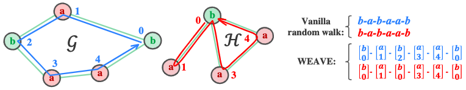

# Inductive and Unsupervised Representation Learning on Graph Structured Objects
This repository contains code for our International Conference on Learning Representations (ICLR) 2020 paper: [Inductive and Unsupervised Representation Learning on Graph Structured Objects](https://openreview.net/pdf?id=rkem91rtDB) (SEED).

For quick understanding of our work, please also see the [video](https://iclr.cc/virtual_2020/poster_rkem91rtDB.html) which is the presentation in ICLR2020.

## Introduction
<div align="center">
    
</div>

Inductive and unsupervised graph learning is a critical technique for predictive or information retrieval tasks where label information is difficult to obtain. It is also challenging to make graph learning inductive and unsupervised at the same time, as learning processes guided by reconstruction error based loss functions inevitably demand graph similarity evaluation that is usually computationally intractable.

<div align="center">
    
</div>

In this paper, we propose a general framework SEED (Sampling, Encoding, and Embedding Distributions) for inductive and unsupervised representation learning on graph structured objects. Instead of directly dealing with the computational challenges raised by graph similarity evaluation, given an input graph, the SEED framework samples a number of subgraphs whose reconstruction errors could be efficiently evaluated, encodes the subgraph samples into a collection of subgraph vectors, and employs the embedding of the subgraph vector distribution as the output vector representation for the input graph. By theoretical analysis, we demonstrate the close connection between SEED and graph isomorphism. Using public benchmark datasets, our empirical study suggests the proposed SEED framework is able to achieve up to 10% improvement, compared with competitive baseline methods.

## Authors
Welcome to send us Emails if you have any questions about the code and our work :-)
* **Lichen Wang** [Website](https://sites.google.com/site/lichenwang123/)
* **Bo Zong** [Website](http://www.nec-labs.com/bo-zong)
* **Qianqian Ma** [Website](https://sites.google.com/a/bu.edu/qianqianma/)
* **Wei Cheng** [Website](https://chengw07.github.io/)
* **Jingchao Ni** [Website](https://nijingchao.github.io/)
* **Wenchao Yu** [Website](http://www.nec-labs.com/wenchao-yu)
* **Yanchi Liu** [Website](http://www.nec-labs.com/yanchi-liu)
* **Dongjin Song** [Website](http://www.nec-labs.com/dongjin-song)
* **Haifeng Chen** [Website](http://www.nec-labs.com/haifeng-chen)
* **Yun Raymond Fu** [Website](http://www1.ece.neu.edu/~yunfu/)

## Citation
Please cite our paper if you like or use our work for your research, thank you very much!
```
@inproceedings{SEED_Lichen,
title={Inductive and Unsupervised Representation Learning on Graph Structured Objects},
author={Lichen Wang and Bo Zong and Qianqian Ma and Wei Cheng and Jingchao Ni and Wenchao Yu and Yanchi Liu and Dongjin Song and Haifeng Chen and Yun Fu},
booktitle={International Conference on Learning Representations},
year={2020},
url={https://openreview.net/forum?id=rkem91rtDB}
}
```

